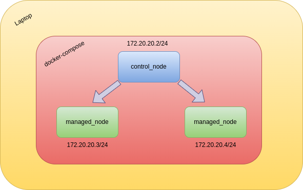

# Ansible Training

In order to get familiar with Ansible and oversee some of its use cases, it is preferred to have many nodes to work with, otherwise one can't appreciate its usefulness.
The easiest way to make it approachable for everyone seems to use Docker, and to manage nodes locally !

Please keep in mind that this training has been designed for Linux users.

## Prerequisites:

- Have docker and docker-compose installed ;
- Read [Ansible documentation](https://docs.ansible.com/ansible/latest/getting_started/index.html).

## Initialize the infrastructure:

Run the initialization script `./ansible_training start`. It builds the necessary infrastructure for the training.

Throughout this training, here's the infrastructure you'll be working on.



This infrastructure simulates a real situation : we execute Ansible tasks from a node (referred here as the **control node**) to remote nodes (referred here as the **managed nodes**).

## Hands-on Ansible : basics

### First manipulations

0. The default configuration comes with 5 nodes, feel free to decrease or increase this number.
```bash
cat .env
MANAGED_NODES=5
```
If you change this number, you'll need to rebuild the training : `./ansible-training rebuild`.

1. Once the docker-compose is up and running, execute the command :

```bash
docker-compose exec -it control_node bash
```

2. Place yourself in root's home folder.

```bash
cd /root
```

3. Ansible allows you to handle remote hosts, as long as you can join them by SSH.
The first step to any Ansible operation is to define these hosts, through an **`inventory`** file.
Go on and create a file named `hosts` that will contain the IPs of our managed nodes.

```bash
cat hosts
172.20.20.3
172.20.20.4
```

4. Let's execute our first Ansible command : pinging our remote hosts. For this operation, we need to tell Ansible :
- The name of the hosts we want to execute commands on, we can use the `all` pattern to execute it on every host in the inventory ;
- The file that contains the inventory. It's specified with the `-i filename` option ;
- The ping action. We can use a built-in Ansible module `ping`, that can be specified with the `-m module` option.

```bash
ansible all -i hosts -m ping
```

Your output should look like this :
```
172.20.20.3 | SUCCESS => {
    "ansible_facts": {
        "discovered_interpreter_python": "/usr/bin/python3"
    },
    "changed": false,
    "ping": "pong"
}
172.20.20.4 | SUCCESS => {
    "ansible_facts": {
        "discovered_interpreter_python": "/usr/bin/python3"
    },
    "changed": false,
    "ping": "pong"
}

...

```

You're not compelled to ping them all, you can try to ping only one of them :

```bash
ansible 172.20.20.3 -i hosts -m ping

172.20.20.3 | SUCCESS => {
    "ansible_facts": {
        "discovered_interpreter_python": "/usr/bin/python3"
    },
    "changed": false,
    "ping": "pong"
}
```

## Hands-on Ansible : 

TODO
